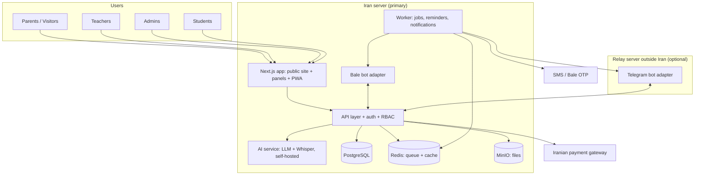

# پروپوزال پلتفرم هوشمند «خانه ایده»

> نام کاری محصول: **ایده‌یار** (پلتفرم وب + ربات بله/تلگرام + دستیار هوشمند)
> نسخه: ۰.۴ (پیش‌نویس برای بررسی؛ آزمون ورودی سنی و پنل کامل معلم)
> تاریخ: مهر ۱۴۰۵

---

## ۰. خلاصه در یک نگاه

خانه ایده الان یک سایت کند و یک‌طرفه دارد و بیشترِ کار (جواب دادن به پیام‌ها، ثبت‌نام، هماهنگی وقت، پیگیری کلاس‌ها و تکلیف‌ها) دستی و پراکنده انجام می‌شود. پیشنهاد ما یک **سیستم‌عامل یکپارچه برای کل آموزشگاه** است که چهار کار را خودکار می‌کند:

1. **جذب:** سایت سریع و جذاب + ربات‌هایی که ۲۴ ساعته جواب سؤال‌ها را می‌دهند و آدم‌ها را تا رزرو وقت مشاوره/کلاس آزمایشی می‌برند.
2. **ثبت‌نام و رزرو:** ادمین فقط یک‌بار «قالب زمان‌های آزاد» را تعریف می‌کند و سیستم خودش وقت‌ها را پر می‌کند، یادآوری می‌فرستد و پرداخت می‌گیرد.
3. **اداره‌ی روزمره:** یک «اتاق کنترل» که ادمین با چند کلیک ببیند سه‌شنبه ساعت ۱۶ کدام معلم با کدام کلاس و کدام بچه‌ها سر کلاس است، و هر چیزی را با کشیدن و رها کردن عوض کند.
4. **ارتباط بعد از کلاس:** معلم در کمتر از یک دقیقه (حتی با یک ویس) گزارش جلسه و تکلیف را ثبت می‌کند و ربات خودش آن را در گروه بله/تلگرامِ همان کلاس و برای والدین می‌فرستد.

به‌علاوه یک **آزمون ورودی متناسب با سن** (بازی برای بچه‌های کوچک، گفت‌وگو با هوش مصنوعی برای نوجوان‌ها) که بدون اینکه بچه احساس «امتحان» کند، علاقه‌ها و نقاط قوتش را در حوزه‌های مختلف می‌سنجد و برای والدین یک گزارش مفید و برای آموزشگاه یک پیشنهاد مسیر آموزشی می‌سازد.

و در کنار این‌ها **۳۲ ایده‌ی تمایز** (بخش ۵) مثل کارت افتخار قابل استوری، پرتال کامل والدین داخل بله، لیگ آنلاین ربات، دوره‌های آنلاین سراسری و نسخه‌ی SaaS برای آموزشگاه‌های دیگر.

---

## ۱. وضعیت فعلی و مسئله

| مسئله | اثر |
|---|---|
| سایت فعلی (khaneyeide.ir) کند است و گاهی باز نمی‌شود | از دست رفتن مشتری، ضعف سئو، تصویر غیرحرفه‌ای برای «معتبرترین آموزشگاه رباتیک» |
| حجم زیاد پیام در اینستاگرام و پیام‌رسان‌ها | پیام‌های بی‌جواب = لید سوخته |
| هماهنگی وقت مشاوره و کلاس آزمایشی دستی است | دوباره‌کاری، تداخل، فراموشی |
| اطلاعات کلاس‌ها، معلم‌ها، دانش‌آموزها و ساعت‌ها یکجا نیست | ادمین نمی‌تواند سریع جواب بدهد «فلانی الان کجاست؟» |
| گزارش جلسه و تکلیف به‌صورت دستی در گروه‌ها | ناهماهنگ، وابسته به حوصله‌ی معلم، بدون آرشیو |
| شناخت استعداد و علاقه‌ی بچه‌ها سلیقه‌ای است | پیشنهاد دوره‌ی نامناسب، ریزش دانش‌آموز |

---

## ۲. اهداف و معیارهای موفقیت

| هدف | معیار قابل اندازه‌گیری (پیشنهادی، بعد از راه‌اندازی تنظیم می‌شود) |
|---|---|
| سرعت سایت | LCP کمتر از ۲.۵ ثانیه روی موبایل و اینترنت ایران |
| پاسخ به پیام‌ها | پاسخ اولیه به همه‌ی پیام‌های ربات در کمتر از ۱ دقیقه |
| تبدیل لید | درصد لیدهایی که به رزرو وقت/کلاس آزمایشی می‌رسند (پایه‌ی فعلی اندازه‌گیری و سپس هدف‌گذاری می‌شود) |
| زمان کار ادمین | کاهش محسوس زمان هماهنگی‌های تلفنی و پیامی |
| گزارش جلسه | بیش از ۹۵٪ جلسات گزارش ثبت‌شده داشته باشند |
| ماندگاری | درصد تمدید دوره/ثبت‌نام در سطح بعد |

---

## ۳. کاربران و نقش‌ها

| نقش | کارهای اصلی |
|---|---|
| **مدیر کل (Owner)** | همه‌چیز، داشبورد مالی، تنظیمات امنیتی، تعریف نقش‌ها |
| **ادمین/پذیرش** | برنامه‌ی هفتگی، کلاس‌ها، ثبت‌نام، وقت‌های ملاقات، صندوق پیام یکپارچه |
| **معلم (مربی)** | پنل کامل: برنامه، کلاس‌ها، پرونده‌ی دانش‌آموزان، پروژه‌ها، حضور و غیاب، گزارش جلسه، تکالیف، کارنامه‌ها |
| **ولی (والدین)** | ثبت‌نام، پرداخت، دیدن برنامه، گزارش‌ها، تکلیف‌ها، درخواست جلسه‌ی جبرانی |
| **دانش‌آموز (اختیاری)** | پروفایل بازی‌گونه، پروژه‌ها، تحویل تکلیف، آزمون ورودی |
| **مشاور/روانشناس (اختیاری)** | دیدن نتایج آزمون ورودی با دسترسی محدود |
| **بازدیدکننده** | دیدن دوره‌ها، پرسیدن سؤال از ربات، رزرو وقت |

> دسترسی‌ها به‌صورت **نقش + محدوده** تعریف می‌شوند (مثلاً «ادمین شعبه‌ی X» فقط داده‌های همان شعبه را می‌بیند؛ معلم فقط دانش‌آموزان کلاس‌های خودش را).

---

## ۴. ماژول‌ها

### ۴.۱ سایت عمومی (معرفی مجموعه)

- **صفحه‌ی اصلی** با پیام روشن: «بچه‌ها از صفر، ربات خودشان را می‌سازند» + یک دکمه‌ی اصلی (مثلاً «رزرو کلاس آزمایشی»).
- **دوره‌ها بر اساس سن و سطح** (رباتیک، برنامه‌نویسی، هوش مصنوعی، اختراعات، تیم‌های مسابقاتی) با مسیر یادگیری تصویری از سطح ۱ تا مسابقات جهانی.
- **ویترین پروژه‌های دانش‌پژوهان:** عکس/ویدیو واقعی پروژه‌ها (با رضایت والدین). این قوی‌ترین ابزار بازاریابی شماست.
- **افتخارات و مسابقات** (بیش از ۵۰ جایزه‌ی بین‌المللی طبق معرفی فعلی سایت).
- **معرفی مربی‌ها**، سؤالات متداول، وبلاگ (برای سئو)، تماس و نقشه.
- **«کدام دوره برای بچه‌ی من مناسب است؟»**: یک پرسش‌نامه‌ی ۶۰ ثانیه‌ای که به رزرو وقت ختم می‌شود.
- **فنی:** صفحات استاتیک/ISR در Next.js، تصاویر بهینه، فونت فارسی محلی، اسکیمای `EducationalOrganization` و `Course` برای گوگل، و **ریدایرکت ۳۰۱ همه‌ی آدرس‌های قدیمی** تا رتبه‌ی فعلی گوگل از دست نرود (بزرگ‌ترین ریسک مهاجرت از سایت فعلی).

### ۴.۲ قیف جذب و رزرو وقت ملاقات (هسته‌ی خودکارسازی)

**انواع وقت قابل رزرو** (قابل تعریف توسط ادمین): مشاوره‌ی حضوری، مشاوره‌ی تلفنی، کلاس آزمایشی، تعیین سطح، بازدید از آموزشگاه.

**ادمین فقط قالب تعریف می‌کند، سیستم خودش پر می‌کند:**

```
قالب «کلاس آزمایشی رباتیک ۷ تا ۹ سال»
  روزها: شنبه، دوشنبه، چهارشنبه
  ساعت: ۱۶:۰۰ تا ۱۹:۰۰ ، هر اسلات ۴۵ دقیقه ، ظرفیت هر اسلات: ۴ نفر
  مسئول: مربی‌های دارای برچسب «رباتیک مقدماتی» (سیستم خودش بین آن‌ها پخش می‌کند)
  اتاق: کارگاه ۲
  استثناها: تعطیلات رسمی تقویم ایران خودکار حذف می‌شوند + روزهایی که ادمین می‌بندد
  حداقل فاصله تا رزرو: ۳ ساعت ، حداکثر: ۱۴ روز آینده
```

- رزرو از **سایت، ربات بله، ربات تلگرام و لینک اینستاگرام** همه به یک تقویم واحد وصل‌اند (بدون تداخل).
- **تأیید با OTP** شماره‌ی موبایل، سپس پیام تأیید + فایل تقویم.
- **یادآوری خودکار** (۲۴ ساعت و ۲ ساعت قبل) از طریق بله/تلگرام/پیامک با دکمه‌ی «می‌آیم / جابه‌جا کن / لغو».
- **لیست انتظار:** اگر کسی لغو کرد، نفر بعدی خودکار خبر می‌گیرد.
- ثبت **نیامدن (No-show)** و پیگیری خودکار.
- هر رزرو یک **لید** در CRM می‌سازد با منبع (اینستاگرام، بله، سایت، معرفی دوستان) تا بدانید کدام کانال واقعاً جواب می‌دهد.

### ۴.۳ ثبت‌نام، پرداخت و مالی

- ثبت‌نام آنلاین در کلاس با **ظرفیت لحظه‌ای** و لیست انتظار.
- **پرداخت آنلاین** با درگاه‌های داخلی (زرین‌پال، زیبال یا درگاه مستقیم بانک)، پرداخت اقساطی، کد تخفیف، تخفیف خواهر/برادر، تخفیف معرفی.
- فاکتور و رسید خودکار، یادآوری قسط.
- برای ادمین: ثبت پرداخت دستی (کارت‌خوان/نقدی) هم ممکن است.
- **محاسبه‌ی حق‌التدریس مربی** بر اساس جلسات واقعاً برگزارشده (اختیاری، فاز بعد).

### ۴.۴ اتاق کنترل ادمین (مهم‌ترین بخش UX)

سناریوی دقیقاً همان چیزی که گفتید:

1. ادمین وارد می‌شود و **نوار روزهای هفته** را می‌بیند. روی **سه‌شنبه** می‌زند.
2. صفحه به صورت **ستون‌هایی برای هر معلم** (یا با یک کلید: برای هر اتاق) و **ردیف‌هایی برای ساعت‌ها** نمایش داده می‌شود؛ هر کلاس یک کارت رنگی است (رنگ بر اساس دوره).
3. روی یک معلم فیلتر می‌کند یا روی کارت کلاس ساعت ۱۶ می‌زند. **پنل کناری** باز می‌شود:
   - اسم کلاس، دوره، سطح، معلم، اتاق، ظرفیت (مثلاً ۶ از ۸)
   - **لیست دانش‌آموزان** با عکس، شماره‌ی ولی، وضعیت پرداخت، حضور جلسات قبل
   - **گروه‌های متصل:** لینک گروه بله، لینک گروه تلگرام، لینک کلاس آنلاین (در صورت وجود)
   - گزارش‌ها و تکالیف جلسات قبل
   - دکمه‌ها: افزودن دانش‌آموز، انتقال دانش‌آموز، ارسال پیام به همه‌ی والدین کلاس، لغو/جابه‌جایی یک جلسه
4. **کشیدن و رها کردن** کارت کلاس به ساعت/معلم دیگر؛ سیستم **تداخل** (معلم یا اتاق یا دانش‌آموز هم‌زمان) را قبل از ذخیره نشان می‌دهد و بعد از ذخیره به والدین آن کلاس خبر می‌دهد.
5. **جست‌وجوی سراسری (Ctrl+K)**: نوشتن «علی رضایی» یا شماره‌ی موبایل یا «رباتیک ۲» و رسیدن مستقیم به صفحه‌ی مربوط.
6. **«الان در آموزشگاه چه خبر است؟»**: نمای زنده‌ی کلاس‌های در حال برگزاری، معلم‌هایی که حضور نزده‌اند، جلساتی که گزارششان ثبت نشده.
7. **بازگشت (Undo)** برای هر تغییر به جای پنجره‌های «آیا مطمئنید؟» پشت‌سرهم، و **لاگ تغییرات** (چه کسی، کی، چه چیزی را عوض کرد).

**اتصال گروه به کلاس (بدون دردسر):**
- در صفحه‌ی کلاس دکمه‌ی «اتصال گروه تلگرام/بله» را می‌زند.
- در تلگرام: لینک `t.me/<bot>?startgroup=<کد>` باز می‌شود، گروه را انتخاب می‌کند، ربات اضافه و **خودکار به همان کلاس وصل** می‌شود.
- در بله: ربات را به گروه اضافه می‌کند و کد یک‌بارمصرف (مثلاً `/link 4821`) را در گروه می‌فرستد؛ اتصال انجام می‌شود.
- لینک دعوت گروه هم در پروفایل کلاس ذخیره می‌شود تا برای دانش‌آموز جدید خودکار ارسال شود.

### ۴.۵ پنل معلم

هر معلم یک پنل کامل دارد که از گوشی و دسکتاپ کار می‌کند و همه‌چیزِ کلاس‌هایش را یکجا می‌بیند.

**بخش‌های پنل:**

| بخش | چه چیزی می‌بیند و چه کاری می‌کند |
|---|---|
| **امروز من** | کلاس‌های امروز به ترتیب ساعت، اتاق، تعداد حاضرین، کلاس‌هایی که گزارششان مانده |
| **برنامه‌ی من** | تقویم هفتگی و ماهانه‌ی کلاس‌ها، جلسات جبرانی، تغییرات اعلام‌شده توسط ادمین |
| **کلاس‌های من** | برای هر کلاس: لیست دانش‌آموزان، حضور و غیاب همه‌ی جلسات، گزارش‌ها و تکالیف قبلی، سرفصل دوره و اینکه کجای آن هستیم، لینک گروه بله/تلگرام |
| **پرونده‌ی دانش‌آموز** | عکس، سن، سطح، نتیجه‌ی آزمون ورودی (خلاصه‌ی آموزشی، نه جزئیات خصوصی)، یادداشت‌های جلسات قبل، نقاط قوت و چیزهایی که باید رویشان کار شود، نشان‌ها |
| **پروژه‌ها** | گالری پروژه‌های دانش‌آموزان کلاس‌های خودش با عکس و ویدیو و کد؛ ثبت پروژه‌ی جدید؛ انتخاب پروژه برای ویترین سایت یا لیگ. ادمین می‌تواند دسترسی دیدن **پروژه‌های کل آموزشگاه** را هم برای الهام و هماهنگی به معلم‌ها بدهد |
| **تکالیف تحویلی** | صف تکالیف ارسال‌شده توسط بچه‌ها با امکان بازخورد، امتیاز و نشان دادن |
| **منابع آموزشی** | طرح درس، برگه‌ی فعالیت و پروژه‌ی پیشنهادی هر جلسه از سرفصل (کتابخانه‌ی مشترک مربی‌ها) |
| **کارنامه‌ها** | پیش‌نویس کارنامه‌ی روایی پایان ترم که هوش مصنوعی ساخته، برای ویرایش و تأیید |
| **عملکرد من** | تعداد جلسات برگزارشده، درصد گزارش‌های به‌موقع، ماندگاری کلاس‌ها، رضایت والدین؛ و در صورت فعال بودن، حق‌التدریس محاسبه‌شده |

**گزارش پایان جلسه (هدف: کمتر از ۶۰ ثانیه از روی گوشی):**
- **حضور و غیاب با یک لمس** (همه حاضر به صورت پیش‌فرض، فقط غایب‌ها را بزند). کار در حالت آفلاین هم ممکن است (PWA) و بعد همگام می‌شود.
- **فرم گزارش جلسه:**
  - موضوعات تدریس‌شده (چیپ‌های آماده از سرفصل دوره + متن آزاد)
  - تکلیف (متن، فایل، عکس، مهلت)
  - یادداشت کوتاه برای هر دانش‌آموز (اختیاری: یک ایموجی/امتیاز + جمله)
  - عکس پروژه‌های جلسه
  - **یا فقط یک ویس:** معلم یک دقیقه حرف می‌زند، هوش مصنوعی آن را به یک گزارش ساختارمند تبدیل می‌کند و معلم فقط تأیید می‌کند.
- با تأیید معلم:
  - خلاصه‌ی جلسه و تکلیف **در گروه بله/تلگرام همان کلاس** ارسال می‌شود.
  - یادداشت اختصاصی هر بچه **فقط در پیوی والدین خودش** (نه در گروه) ارسال می‌شود.
  - همه‌چیز در پرونده‌ی دانش‌آموز آرشیو می‌شود.
- یادآوری خودکار به معلمی که تا ۲ ساعت بعد از کلاس گزارش ثبت نکرده.
- معلم می‌تواند همه‌ی این‌ها را **از داخل ربات** هم انجام دهد (مینی‌اپ بله/تلگرام).

**محدوده‌ی دسترسی:** معلم فقط دانش‌آموزان و کلاس‌های خودش را با جزئیات می‌بیند؛ اطلاعات مالی والدین و جزئیات خصوصی آزمون ورودی برایش نمایش داده نمی‌شود.

### ۴.۶ پرتال والدین

- برنامه‌ی کلاس‌های فرزند(ها)، تقویم جلسات، تعطیلی‌ها
- **تایم‌لاین پیشرفت:** گزارش هر جلسه، تکلیف‌ها، عکس پروژه‌ها، نشان‌های کسب‌شده
- وضعیت پرداخت و اقساط، پرداخت آنلاین
- درخواست **جلسه‌ی جبرانی** با انتخاب از کلاس‌های هم‌سطح دارای ظرفیت خالی
- نتیجه‌ی آزمون ورودی و پیشنهاد مسیر بعدی
- نظرسنجی پایان ترم
- ورود با شماره‌ی موبایل + کد یک‌بارمصرف؛ یک ولی می‌تواند چند فرزند داشته باشد.

### ۴.۷ حساب دانش‌آموز (اختیاری)

- برای بچه‌های کوچک‌تر، پروفایل زیرمجموعه‌ی حساب والدین است (بدون نیاز به شماره‌ی جدا).
- **پروفایل بازی‌گونه:** امتیاز (XP)، نشان‌ها، سطح، پروژه‌های من.
- **پورتفولیوی پروژه‌ها** با صفحه‌ی عمومی قابل اشتراک (فقط با رضایت والدین) که هم برای بچه انگیزه است هم برای شما تبلیغ.
- تحویل تکلیف (عکس/ویدیو/فایل کد).
- **گواهی پایان دوره با QR** قابل استعلام.

### ۴.۸ ربات بله و تلگرام (دستیار)

API ربات‌های بله بر پایه‌ی API ربات تلگرام ساخته شده و آدرسش `https://tapi.bale.ai/bot<token>/METHOD` است. پس **یک کدبیس برای هر دو** می‌نویسیم و فقط آدرس سرور فرق می‌کند. بله در ایران بدون فیلتر در دسترس است، از **مینی‌اپ** پشتیبانی می‌کند و سرویس **ارسال رایگان OTP** هم دارد.

**در چت خصوصی (برای عموم و والدین):**
- جواب سؤالات (قیمت، سن مناسب، آدرس، زمان‌بندی) از روی **پایگاه دانش** که ادمین در پنل ویرایش می‌کند؛ اگر جواب را نداند، گفت‌وگو را به صندوق پیام ادمین می‌فرستد (Human handoff).
- پیشنهاد دوره بر اساس سن و علاقه
- **رزرو وقت/کلاس آزمایشی داخل خود ربات** (مینی‌اپ)
- اتصال حساب والدین با «اشتراک‌گذاری شماره» و از آن به بعد: برنامه، گزارش، تکلیف، لینک پرداخت، یادآوری قسط
- ارسال گزارش اختصاصی فرزند بعد از هر جلسه

**در گروه‌های کلاس:**
- انتشار خودکار گزارش جلسه و تکلیف
- یادآوری قبل از کلاس و قبل از مهلت تکلیف
- اطلاع‌رسانی تغییر ساعت/لغو جلسه
- جواب به سؤال‌هایی که ربات در آن‌ها **منشن** شده
- ضداسپم و حذف لینک‌های تبلیغاتی (اختیاری)

**برای کارکنان:**
- اعلان لید جدید، پرداخت جدید، کلاس بدون گزارش
- خلاصه‌ی روزانه برای مدیر هر شب

> نکته‌ی واقع‌بینانه: ربات‌ها **خودشان نمی‌توانند عضو گروه شوند**؛ یک ادمین گروه باید اضافه‌شان کند. ما این را به یک کلیک (بخش ۴.۴) تبدیل کرده‌ایم. همچنین در تلگرام ربات به‌صورت پیش‌فرض فقط پیام‌هایی را می‌بیند که منشن یا ریپلای شده‌اند (Privacy Mode) که برای حریم خصوصی گروه‌ها خوب است.

### ۴.۹ اینستاگرام (جواب خودکار به دایرکت)

این بخش نیاز به **تصمیم آگاهانه** دارد، چون محدودیت‌های جدی دارد:

| راه | توضیح | ریسک |
|---|---|---|
| **الف) API رسمی متا (Instagram Messaging API)** | جواب خودکار رسمی، کامنت به دایرکت (مثلاً «بنویس ربات تا لینک بیاد»)، فقط داخل پنجره‌ی ۲۴ ساعته بعد از پیام کاربر. نیاز به حساب Professional، اپ متا، **تأیید هویت کسب‌وکار (Business Verification)** و بررسی اپ دارد. | شرایط متا استفاده از محصولاتش را برای کشورهای تحت تحریم جامع آمریکا محدود می‌کند و اجازه‌ی دور زدن موقعیت را نمی‌دهد؛ برای یک کسب‌وکار ایرانی احتمالاً قابل انجام نیست مگر یک نهاد حقوقی واقعی و مجاز خارج از ایران داشته باشید. |
| **ب) ابزارهای غیررسمی** (کتابخانه‌هایی که با یوزر/پسورد وارد اکانت می‌شوند یا شبیه‌سازی مرورگر) | فنی ممکن است. | **پیشنهاد نمی‌کنیم:** خلاف قوانین اینستاگرام است و ممکن است پیج اصلی با همه‌ی فالوورهایش محدود یا بسته شود. |
| **ج) قیف هوشمند با امکانات داخلی اینستاگرام** (پیشنهاد فاز اول) | استفاده از پاسخ‌های ذخیره‌شده و سؤال‌های متداول/شروع‌کننده‌های گفت‌وگو در خود اینستاگرام، که همه به **یک لینک** ختم می‌شوند: «برای جواب فوری و رزرو، به ربات ما در بله پیام بدهید» + لینک بایو به صفحه‌ی هوشمند سایت. | بدون ریسک؛ کار ادمین را به کپی یک جواب آماده کاهش می‌دهد و بقیه‌ی گفت‌وگو را ربات انجام می‌دهد. |

**پیشنهاد:** فاز اول راه «ج». معماری را طوری می‌سازیم که «صندوق پیام یکپارچه» (Omnichannel Inbox) کانال‌پذیر باشد؛ اگر روزی راه «الف» به شکل قانونی برایتان ممکن شد، فقط یک کانال جدید به آن اضافه می‌شود.

### ۴.۱۰ آزمون ورودی کشف علاقه و استعداد («سفر کاوشگر»)

شکل آزمون **بر اساس سن** عوض می‌شود: بچه‌های کوچک بازی می‌کنند، بزرگ‌ترها با یک هوش مصنوعی گفت‌وگو می‌کنند. در همه‌ی سنین هیچ نمره، تایمر استرس‌زا یا جواب غلطی وجود ندارد و حس «امتحان» به بچه داده نمی‌شود.

| گروه سنی | شکل آزمون | جزئیات |
|---|---|---|
| **۶ تا ۸ سال** | **بازی تصویری با راوی صوتی** | بدون نیاز به خواندن؛ بچه در یک داستان (مثلاً جزیره‌ی اختراعات) بین تصویرها انتخاب می‌کند و مینی‌بازی‌های خیلی ساده انجام می‌دهد (چیدن قطعات، پیدا کردن الگو، رنگ‌آمیزی آزاد). حدود ۱۰ دقیقه. والد می‌تواند کنارش باشد. |
| **۹ تا ۱۲ سال** | **بازی داستانی + مینی‌بازی‌های فکری** | مأموریت داستانی با انتخاب‌ها، معماهای منطقی، طراحی و ساخت مجازی؛ سؤال‌های علاقه‌سنجی (دوست دارم / در آن خوبم) داخل داستان پنهان شده‌اند. حدود ۱۵ دقیقه. |
| **۱۳ سال به بالا** | **گفت‌وگو با دستیار هوش مصنوعی + چالش عملی کوتاه** | یک «مصاحبه‌ی دوستانه» متنی یا صوتی: هوش مصنوعی درباره‌ی علاقه‌ها، پروژه‌هایی که دوست دارد بسازد، تجربه‌هایش در برنامه‌نویسی، ریاضی، هنر، کار تیمی و... سؤال می‌پرسد و **سؤال بعدی را بر اساس جواب قبلی** انتخاب می‌کند تا عمیق‌تر شود. بعد یک چالش عملی کوتاه (معمای منطقی یا یک تکه کد ساده متناسب با سطح ادعاشده) برای سنجش واقعی. حدود ۱۵ تا ۲۰ دقیقه. |

**قواعد گفت‌وگوی هوش مصنوعی با نوجوان‌ها:**
- فقط در محدوده‌ی **علاقه‌ها، تجربه‌ها و مهارت‌های آموزشی** سؤال می‌پرسد؛ سؤال‌های شخصی، خانوادگی، پزشکی یا روانی ممنوع است.
- لحن دوستانه و تشویقی، کوتاه، با امکان «رد کردن سؤال».
- سؤال‌های پایه از یک **بانک سؤال تأییدشده توسط روانشناس** می‌آیند و هوش مصنوعی فقط ترتیب و پیگیری را تنظیم می‌کند.
- خروجی یک **پروفایل ساختارمند** است (علایق، سطح تقریبی هر مهارت، پیشنهاد دوره) که مربی قبل از ارسال برای والدین بازبینی می‌کند.
- متن کامل گفت‌وگو برای والدین قابل مشاهده است.

**تعیین سطح:** برای کسانی که قبلاً رباتیک یا برنامه‌نویسی کار کرده‌اند، نتیجه‌ی چالش‌های عملی سطح شروع (مثلاً رباتیک ۲ به‌جای ۱) را پیشنهاد می‌دهد.

**پشتوانه‌ی علمی (برای طراحی سؤال‌ها):**
- مدل علایق شش‌گانه‌ی **هالند (RIASEC)**: واقع‌گرا (ساختن)، جست‌وجوگر (کشف و حل مسئله)، هنری، اجتماعی، متهور (رهبری)، قراردادی (نظم). ابزار **ICA-R** و نسخه‌ی جدیدش **ICA-3** دقیقاً برای کودکان (حدوداً ۹ تا ۱۴ سال) طراحی شده‌اند: ۳۰ فعالیت آشنا برای بچه‌ها که دو بار سنجیده می‌شوند، یک بار «چقدر دوستش دارم» و یک بار «چقدر در آن خوبم». ICA-3 برای کم کردن سوگیری جنسیتی بازطراحی شده است.
- الهام از حوزه‌های **هوش‌های چندگانه‌ی گاردنر** (منطقی، فضایی، زبانی، بدنی، میان‌فردی و...)، با این آگاهی که این مدل برای «برچسب زدن» مناسب نیست و فقط زبان خوبی برای گفت‌وگو با والدین است.
- **مینی‌بازی‌ها و چالش‌های عملی** (مثلاً چیدن قطعات، الگویابی، طراحی آزاد، تصمیم تیمی، تکه کد ساده) رفتار واقعی را می‌سنجند، نه فقط ادعای بچه را. پژوهش‌ها نشان می‌دهند ارزیابی بازی‌گونه برای بچه‌ها از پرسش‌نامه‌ی طولانی بهتر جواب می‌دهد.
- **مشاهده‌ی مربی در کلاس آزمایشی** (فرم کوتاه: پشتکار، خلاقیت، همکاری، دقت) به‌عنوان منبع سوم.

**خروجی:**
- برای **بچه:** شخصیت کاوشگر + نشان + پیشنهاد یک پروژه‌ی جذاب (برای نوجوان‌ها: خلاصه‌ی علاقه‌ها و مسیر پیشنهادی).
- برای **والدین:** گزارش مثبت‌نگر «نقاط قوت و علاقه‌ها» + پیشنهاد مسیر آموزشی + چند فعالیت خانگی.
- برای **آموزشگاه و مربی:** پیشنهاد دوره و سطح شروع مناسب و داده‌ی تجمیعی (بدون نام) برای طراحی دوره‌های جدید.

**خط قرمزهای اخلاقی (غیرقابل مذاکره):**
1. **رضایت آگاهانه‌ی والدین** قبل از شروع؛ بچه هر وقت خواست می‌تواند متوقف کند.
2. **تشخیص بالینی نیست** و این جمله در گزارش صریحاً نوشته می‌شود؛ هیچ برچسبی مثل «ضعیف» یا «باهوش» استفاده نمی‌شود.
3. **سؤال‌ها و متن گزارش باید توسط یک روانشناس کودک دارای مجوز** بازبینی و روی گروه کوچکی از بچه‌های ایرانی آزمایش شوند.
4. ابزارهای منتشرشده (مثل ICA) حق نشر دارند؛ یا از صاحب اثر مجوز می‌گیریم یا سؤال‌های **اختصاصی خودمان** را با کمک روانشناس می‌سازیم.
5. نتایج فقط برای والدین و کارکنان مجاز قابل مشاهده است، رمزنگاری می‌شود و والدین می‌توانند حذفشان کنند.

### ۴.۱۱ هوش مصنوعی در کل سیستم (همیشه با تأیید انسان)

| کاربرد | توضیح |
|---|---|
| ویس به گزارش | تبدیل صدای معلم به گزارش ساختارمند جلسه |
| مصاحبه‌ی ورودی نوجوان‌ها | گفت‌وگوی تطبیقی برای کشف علاقه و سطح (بخش ۴.۱۰) |
| پاسخ‌گوی ربات | جواب بر اساس پایگاه دانش خودتان (RAG)، نه حدس |
| خلاصه برای والدین | تبدیل یادداشت فنی معلم به زبان ساده و مثبت |
| پیشنهاد دوره | بر اساس سن، علاقه و نتیجه‌ی آزمون ورودی |
| هشدار ریزش | الگوی غیبت، تکلیف تحویل‌نشده یا قسط عقب‌افتاده |
| خلاصه‌ی شبانه‌ی مدیر | «امروز ۷ لید جدید، ۲ کلاس بدون گزارش، ۳ قسط سررسید» |

> **انتخاب سرویس مدل زبانی** باید با محدودیت‌های تحریم و شرایط استفاده‌ی هر سرویس‌دهنده سازگار باشد. پیشنهاد فنی: یک لایه‌ی واسط (Provider-agnostic) بسازیم تا مدل قابل تعویض باشد، و گزینه‌ی امن را **مدل‌های متن‌باز روی سرور خودمان** (مثل خانواده‌های Qwen، Gemma یا Llama که فارسی را هم پشتیبانی می‌کنند) در نظر بگیریم. برای تبدیل گفتار به متن هم مدل متن‌باز Whisper قابل اجرا روی سرور است.

### ۴.۱۲ داشبورد مدیریتی و گزارش‌ها

- درصد پر بودن کلاس‌ها (به تفکیک دوره، معلم، روز و ساعت): کدام ساعت‌ها خالی می‌مانند؟
- قیف فروش: پیام ← رزرو ← آمدن ← ثبت‌نام (به تفکیک کانال)
- ماندگاری و تمدید در هر سطح
- درآمد، اقساط معوق، تخفیف‌های داده‌شده
- عملکرد مربی‌ها: ثبت به‌موقع گزارش، رضایت والدین، ماندگاری کلاس
- خروجی اکسل از هر جدول

---

## ۵. ایده‌های خفن‌تر (پیشنهاد ما برای تمایز)

### ۵.۱ دور اول

1. **بازار جلسه‌ی جبرانی:** دانش‌آموزی که غیبت داشته، خودش از بین کلاس‌های هم‌سطح با جای خالی یک جلسه انتخاب می‌کند. بدون تماس با پذیرش.
2. **نقشه‌ی مسیر یادگیری (Skill Tree):** مثل بازی‌ها؛ هر مهارت (مثلاً «سنسور فاصله»، «حلقه در پایتون») یک گره است که با پروژه باز می‌شود. والدین پیشرفت را می‌بینند و انگیزه‌ی ادامه‌ی سطح بعد بالا می‌رود.
3. **کمپین تمدید خودکار:** دو هفته مانده به پایان ترم، پیام شخصی‌سازی‌شده به والدین با گزارش پیشرفت و پیشنهاد سطح بعد و لینک پرداخت.
4. **برنامه‌ی معرفی (Referral):** هر ولی یک لینک اختصاصی دارد؛ ثبت‌نام از طریقش تخفیف دو طرفه دارد.
5. **مدیریت تیم‌های مسابقاتی:** تیم‌ها، تقویم مسابقات، چک‌لیست آماده‌سازی، آرشیو افتخارات که خودکار در سایت نمایش داده می‌شود.
6. **انبار کیت‌ها و قطعات:** ثبت امانت کیت به دانش‌آموز، موجودی قطعات، هشدار کمبود.
7. **روز دمو و نمایشگاه مجازی:** پایان هر ترم، گالری پروژه‌ها با رأی‌گیری والدین.
8. **کلاس آنلاین یکپارچه:** لینک کلاس آنلاین (اسکای‌روم یا BigBlueButton) برای هر جلسه خودکار ساخته و در گروه کلاس ارسال شود.
9. **تقویم شمسی و تعطیلات خودکار:** جلسات تعطیل رسمی خودکار جابه‌جا می‌شوند و پیشنهاد جلسه‌ی جبرانی ساخته می‌شود.
10. **نظرسنجی NPS** پایان هر ترم و هشدار به مدیر برای نارضایتی.

### ۵.۲ دور دوم: ایده‌های بمب

**الف) موتور رشد و بازاریابی خودکار**

11. **کارت افتخار قابل اشتراک:** هر بار که بچه پروژه‌ای تمام می‌کند یا نشانی می‌گیرد، سیستم خودکار یک **تصویر زیبا در اندازه‌ی استوری** می‌سازد (عکس پروژه + اسم کوچک بچه + لوگوی خانه ایده + QR لینک معرفی والد). والدین به‌طور طبیعی آن را استوری می‌کنند و هر استوری یک تبلیغ رایگان و قابل ردیابی است. انتشار فقط با رضایت والدین.
12. **ویدیوی خلاصه‌ی ترم:** پایان هر ترم، از عکس‌ها و ویدیوهای کوتاه جلسات یک **ویدیوی ۳۰ ثانیه‌ای خودکار** برای هر بچه ساخته می‌شود: «سفر علی در رباتیک ۲». بهترین ابزار برای تمدید ثبت‌نام و معرفی به دوستان.
13. **حالت نمایشگاه:** برای نمایشگاه‌ها، مدرسه‌ها و روزهای بازدید: یک تبلت با نسخه‌ی کوتاه آزمون ورودی (۳ دقیقه) + فرم سریع شماره. والد همان‌جا نتیجه و پیشنهاد کلاس آزمایشی را در بله می‌گیرد. هر لید با برچسب همان رویداد ثبت می‌شود تا بازده هر نمایشگاه معلوم شود.
14. **QR روی پروژه‌ها و کیت‌ها:** روی هر ربات ساخته‌شده در نمایشگاه یا ویترین آموزشگاه یک QR که به صفحه‌ی پروژه، ویدیوی کارکردن و اسم سازنده‌اش می‌رود.
15. **کمپ‌ها، کارگاه‌ها و رویدادها:** ماژول فروش بلیت برای کمپ تابستانی، کارگاه یک‌روزه، هکاتون بچه‌ها و جشن تولد رباتیک؛ با ظرفیت، پرداخت و لیست حضور. اغلب پرسودترین بخش آموزشگاه‌های مشابه است.
16. **کارت هدیه‌ی دوره:** «یک ترم رباتیک هدیه بده» برای تولد و عید؛ با کد قابل استفاده در ثبت‌نام.
17. **قیمت‌گذاری هوشمند ساعت‌های خلوت:** سیستم ساعت‌هایی را که همیشه خالی می‌مانند پیدا می‌کند و پیشنهاد تخفیف خودکار برای همان ساعت‌ها را به ادمین می‌دهد (با تأیید ادمین فعال می‌شود).

**ب) یادگیری بین جلسات (بچه‌ها را درگیر نگه می‌دارد)**

18. **چالش هفتگی داخل مینی‌اپ بله:** معماهای برنامه‌نویسی بلوکی (شبیه اسکرچ/Blockly) و سؤال‌های کوتاه مرتبط با درس همان هفته، با جدول امتیاز **هر کلاس** (نه رقابت سراسری که بچه‌های ضعیف‌تر را دلسرد کند).
19. **شبیه‌ساز ربات در مرورگر:** یک ربات مجازی دوبعدی که بچه در خانه، بدون کیت، با کد بلوکی یا پایتون حرکتش می‌دهد. برای تمرین تکلیف و برای دانش‌آموزان آنلاین عالی است.
20. **دستیار پروژه‌ی امن برای بچه‌ها (AI Tutor):** دستیاری که **جواب را نمی‌دهد**، فقط با سؤال و راهنمایی قدم‌به‌قدم کمک می‌کند (روش سقراطی)، فقط در محدوده‌ی سرفصل دوره حرف می‌زند، اطلاعات شخصی نمی‌پرسد، فیلتر محتوا دارد و گفت‌وگوها برای معلم و والدین قابل مشاهده است. فقط با فعال‌سازی والدین.
21. **شبکه‌ی منتورها:** دانش‌آموزان سطح بالا و تیم‌های مسابقاتی، منتور بچه‌های سطح پایین می‌شوند و نشان «منتور» و ساعت خدمت می‌گیرند. هم برای بزرگ‌ترها انگیزه است هم برای کوچک‌ترها الگو.

**ج) عملیات هوشمند پشت صحنه**

22. **چیدمان خودکار برنامه‌ی ترم جدید:** ادمین فقط محدودیت‌ها را می‌دهد (ساعات آزاد هر معلم، اتاق‌ها، تقاضای لیست انتظار برای هر سطح و ساعت، خواهر و برادرهایی که باید هم‌زمان کلاس داشته باشند) و یک **حل‌کننده‌ی بهینه‌سازی** (مثل Google OR-Tools یا Timefold) پیش‌نویس کامل برنامه را می‌سازد. ادمین فقط ویرایش و تأیید می‌کند. کاری که الان روزها طول می‌کشد، چند دقیقه می‌شود.
23. **نقشه‌ی حرارتی تقاضا و پیشنهاد کلاس جدید:** وقتی لیست انتظار یک سطح در یک بازه‌ی زمانی از حدی بیشتر شد، سیستم پیشنهاد می‌دهد: «برای رباتیک ۱، شنبه ۱۷ یک کلاس جدید باز کنید؛ ۷ نفر منتظرند و مربی X آزاد است.» با یک کلیک کلاس ساخته و به منتظرها خبر داده می‌شود.
24. **دستیار طرح درس برای مربی‌ها:** کتابخانه‌ی مشترک طرح درس، برگه‌ی فعالیت و پروژه برای هر جلسه از سرفصل، تا کیفیت کلاس‌ها به مربی وابسته نباشد و **آموزش مربی جدید** سریع شود.
25. **همکاری با مدرسه‌ها (B2B):** ماژولی برای قراردادهای تدریس در مدرسه‌ها: اعزام مربی، برنامه‌ی کلاس‌ها در مدرسه، گزارش ماهانه‌ی خودکار برای مدیر مدرسه و صورت‌حساب. یک کانال درآمد و جذب بزرگ.
26. **پرتال کامل والدین داخل بله (سوپراپ):** همه‌ی امکانات پرتال والدین به‌صورت **مینی‌اپ بله**؛ والد بدون نصب هیچ اپی و بدون یادگرفتن رمز، از داخل پیام‌رسانی که هر روز باز می‌کند همه‌چیز را دارد. برای والدین ایرانی شاید بیشترین اثر را روی پذیرش سیستم داشته باشد.
27. **کانال‌های قابل افزودن:** معماری صندوق پیام طوری است که بعداً ایتا، روبیکا یا پیامک دوطرفه فقط به‌عنوان «کانال جدید» اضافه شوند.

### ۵.۳ دور سوم: از آموزشگاه به برند ملی

28. **لیگ آنلاین ربات خانه ایده:** مسابقه‌ی ماهانه روی شبیه‌ساز مرورگری (ایده‌ی ۱۹)، باز برای بچه‌های همه‌ی شهرها، با جدول رده‌بندی، رده‌های سنی و جایزه. خانه ایده را از یک آموزشگاه تهرانی به یک **برند ملی** تبدیل می‌کند و برای دوره‌های آنلاین لید سراسری می‌آورد.
29. **فروشگاه کیت و قطعات:** برای هر دوره و سطح «کیت پیشنهادی»، خرید قطعات پروژه‌ی پایان ترم از داخل پلتفرم، یکپارچه با انبار کیت‌ها (ایده‌ی ۶) و ارسال برای دانش‌آموزان آنلاین شهرهای دیگر. یک خط درآمد جدید.
30. **کارنامه‌ی روایی پایان ترم:** هوش مصنوعی از گزارش‌های همه‌ی جلسات ترم یک کارنامه‌ی **توصیفی و مهارت‌محور** می‌نویسد (مثلاً «در حل مسئله رشد چشمگیری داشته و در کار تیمی پیشرو بوده»)، معلم ویرایش و تأیید می‌کند و برای والدین ارسال می‌شود.
31. **دوره‌های آنلاین برای شهرهای دیگر:** ترکیب کلاس زنده + ویدیوی ضبط‌شده + کیت ارسالی (ایده‌ی ۲۹) + شبیه‌ساز. بازار را از تهران به کل ایران می‌برد و با لیگ آنلاین (ایده‌ی ۲۸) یک چرخه‌ی جذب سراسری می‌سازد.
32. **نسخه‌ی SaaS برای آموزشگاه‌های دیگر:** وقتی پلتفرم برای خانه ایده جا افتاد، به‌صورت اشتراکی به آموزشگاه‌های رباتیک، زبان، هنر و ورزش فروخته شود. برای همین **از روز اول معماری چندمستأجره (Multi-tenant)** است: هر آموزشگاه داده، برند، دامنه و ربات خودش را دارد. هزینه‌ی این تصمیم الان کم است و بعداً بسیار گران.

### ۵.۴ اولویت‌بندی پیشنهادی ایده‌ها

| اولویت | ایده‌ها | چرا |
|---|---|---|
| **سریع و پراثر** (همراه فاز ۱ و ۲) | ۲۶ پرتال در بله، ۱۱ کارت افتخار، ۱ جلسه‌ی جبرانی | هزینه‌ی کم، اثر مستقیم روی رضایت و جذب |
| **فاز رشد** | ۳ تمدید خودکار، ۴ معرفی، ۱۲ ویدیوی ترم، ۱۳ حالت نمایشگاه، ۱۵ کمپ‌ها، ۱۶ کارت هدیه، ۲۳ پیشنهاد کلاس جدید | درآمد و جذب |
| **فاز تمایز** | ۲ Skill Tree، ۱۸ چالش هفتگی، ۱۹ شبیه‌ساز، ۲۲ چیدمان خودکار، ۲۴ طرح درس | سرمایه‌گذاری بیشتر، مزیت رقابتی بلندمدت |
| **برند ملی و درآمد جدید** | ۲۸ لیگ آنلاین، ۲۹ فروشگاه کیت، ۳۰ کارنامه‌ی روایی، ۳۱ دوره‌های آنلاین سراسری | رشد بیرون از تهران و خطوط درآمد تازه |
| **تصمیم معماری از روز اول** | ۳۲ چندمستأجره برای نسخه‌ی SaaS | فقط ساختار داده؛ فروش بعد از جا افتادن محصول |
| **با احتیاط و بعد از پایلوت** | ۲۰ دستیار AI بچه‌ها، ۱۷ قیمت‌گذاری هوشمند، ۲۵ B2B | نیاز به سیاست‌گذاری، تست و تصمیم مدیریتی |

---

## ۶. طراحی تجربه‌ی کاربری (UX/UI)

**خوانش طراحی:**
- **سایت عمومی:** سایت آموزشی برای والدین و بچه‌ها، با زبان «بازیگوش اما معتبر و حرفه‌ای»، با تکیه بر عکس واقعی پروژه‌های بچه‌ها، حرکت‌های معنادار و سبک، و تم روشن/تیره.
- **پنل‌ها (ادمین/معلم/والدین):** محصول روزمره، تمیز، سریع، با تراکم اطلاعات متوسط و تمرکز بر کمترین تعداد کلیک.

**اصول:**
1. **فارسی و راست‌به‌چپ از روز اول** (نه ترجمه‌ی بعدی)، اعداد فارسی، **تقویم شمسی** در همه‌جا، منطقه‌ی زمانی تهران.
2. **موبایل‌اول:** معلم و والدین ۹۰٪ مواقع با گوشی کار می‌کنند. ادمین روی دسکتاپ و گوشی هر دو.
3. **قانون ۳ لمس:** کارهای پرتکرار (حضور و غیاب، ثبت گزارش، دیدن کلاس یک روز، رزرو وقت) حداکثر با ۳ لمس.
4. **پیش‌فرض‌های هوشمند:** همه حاضر، ساعت بعدی، معلم همیشگی.
5. **ویرایش درجا** به جای فرم‌های جدا؛ **Undo** به جای پنجره‌ی تأیید.
6. **حالت‌های خالی راهنما:** «هنوز کلاسی برای سه‌شنبه نساخته‌اید، اولین کلاس را بسازید».
7. **اسکلت بارگذاری** به جای چرخنده؛ خطاهای واضح کنار همان فیلد.
8. **دسترس‌پذیری:** کنتراست استاندارد WCAG AA، قابل استفاده با کیبورد، احترام به تنظیم «کاهش حرکت».
9. **قابل نصب (PWA)** روی صفحه‌ی گوشی با اعلان.

**سیستم بصری پیشنهادی:**
- فونت: **وزیرمتن (Vazirmatn)** متن‌باز و خوانا، به‌صورت محلی (بدون وابستگی به Google Fonts که در ایران ناپایدار است).
- رنگ: یک رنگ تأکیدی واحد برگرفته از لوگوی فعلی خانه ایده + خاکستری‌های خنثی؛ پرهیز از گرادیان‌های بنفش کلیشه‌ای.
- کامپوننت‌ها: **shadcn/ui (بر پایه‌ی Radix)** سفارشی‌شده با Tailwind، آیکون‌های **Phosphor**.
- انیمیشن: Motion، فقط جایی که معنا دارد (بازخورد، تغییر وضعیت، روایت در سایت).
- قبل از کدنویسی، صفحات کلیدی (اتاق کنترل، گزارش جلسه، رزرو) به‌صورت نمونه‌ی تعاملی ساخته و با ۲ ادمین و ۳ معلم واقعی تست می‌شوند.

---

## ۷. معماری فنی

### ۷.۱ نمای کلی



**چرا سرور اصلی در ایران؟**
- درگاه‌های پرداخت داخلی و سرویس‌های پیامک/بله پایدارترند.
- در زمان اختلال اینترنت بین‌الملل، سایت، پنل‌ها و ربات بله **همچنان کار می‌کنند**.
- دسترسی سریع‌تر برای کاربران ایرانی.

**چرا سرور واسط خارج برای تلگرام؟** API تلگرام از داخل ایران در دسترس نیست. یک سرویس کوچک بیرون از ایران پیام‌ها را بین تلگرام و سرور اصلی رد و بدل می‌کند (با احراز هویت امضاشده). اگر اینترنت بین‌الملل قطع شود فقط کانال تلگرام موقتاً از کار می‌افتد و پیام‌ها در صف می‌مانند.

### ۷.۲ پشته‌ی فنی پیشنهادی

| لایه | انتخاب | دلیل |
|---|---|---|
| زبان | TypeScript در کل پروژه | یک زبان برای همه‌چیز، مناسب Cursor |
| ساختار | Monorepo با pnpm + Turborepo | اشتراک کد بین وب، ربات و ورکر |
| چندمستأجره | ستون `tenantId` در همه‌ی جدول‌ها + Row-Level Security در PostgreSQL | آمادگی نسخه‌ی SaaS (ایده‌ی ۳۲) بدون بازنویسی |
| وب | Next.js (App Router) + React | سایت سریع (SSG/ISR) + پنل‌ها در یک اپ |
| UI | Tailwind CSS v4 + shadcn/ui + Phosphor Icons + Motion | سفارشی‌پذیر، RTL، دسترس‌پذیر |
| API | tRPC یا Server Actions + اعتبارسنجی Zod | تایپ امن از دیتابیس تا UI |
| دیتابیس | PostgreSQL + Prisma (یا Drizzle) | رابطه‌ای، قابل اعتماد |
| صف و کار زمان‌بندی‌شده | Redis + BullMQ | یادآوری‌ها، ارسال پیام‌ها، کارهای سنگین |
| فایل | MinIO (سازگار با S3) | تکالیف، عکس پروژه‌ها، ویس‌ها |
| ربات | grammY با دو آداپتر (تلگرام و بله با `apiRoot` متفاوت) | یک کد برای هر دو پیام‌رسان |
| احراز هویت | ورود با موبایل + OTP (پیامک یا OTP بله)؛ برای کارکنان + رمز دوم (TOTP/Passkey) | امن و ساده برای والدین |
| تاریخ | تقویم شمسی (مثلاً date-fns-jalali)؛ منطقه‌ی زمانی `Asia/Tehran` | |
| پرداخت | آداپتر درگاه (زرین‌پال/زیبال) | قابل تعویض |
| هوش مصنوعی | سرویس جدا با لایه‌ی Provider؛ مدل متن‌باز + Whisper | قابل تعویض، سازگار با محدودیت‌ها |
| استقرار | Docker Compose روی سرور ابری ایرانی؛ CDN/WAF داخلی | ساده، قابل انتقال |
| پایش | لاگ ساختارمند، Sentry خودمیزبان یا GlitchTip، Uptime Kuma | |
| تست | Vitest + Playwright (E2E) | |

### ۷.۳ مدل داده (موجودیت‌های اصلی)

- **سازمان:** `Branch` (شعبه)، `Room` (اتاق/کارگاه)، `Holiday` (تعطیلات)
- **افراد:** `User` (با نقش‌ها)، `Guardian` (ولی)، `Student`، `Teacher`، رابطه‌ی چند به چند ولی و دانش‌آموز
- **آموزش:** `Program` (رباتیک، برنامه‌نویسی...)، `Course` (دوره و سطح، با سرفصل)، `ClassGroup` (کلاس: دوره + معلم + اتاق + روز و ساعت + ظرفیت + تاریخ شروع و پایان + گروه‌های متصل)، `Session` (هر جلسه‌ی واقعی)، `Enrollment`، `Attendance`
- **بعد از کلاس:** `SessionReport`، `StudentNote`، `Homework`، `Submission`، `Media`
- **رزرو:** `AppointmentType`، `AvailabilityTemplate` (قالب زمان)، `AvailabilityException`، `Appointment`، `Waitlist`
- **فروش:** `Lead` (با منبع)، `Conversation`/`Message` (صندوق یکپارچه)، `KnowledgeBaseArticle`
- **مالی:** `Invoice`، `Installment`، `Payment`، `Discount`
- **ارتباط:** `ChatLink` (گروه بله/تلگرام ↔ کلاس)، `MessengerAccount` (اتصال کاربر به بله/تلگرام)، `Notification`
- **کشف علاقه:** `Assessment`، `AssessmentItem`، `AssessmentSession`، `AssessmentResult`، `Consent`
- **امنیت:** `AuditLog`، `Session` احراز هویت، `ApiKey`

---

## ۸. امنیت و حریم خصوصی (داده‌ی کودکان = حساس‌ترین داده)

1. **هدف استاندارد:** OWASP ASVS سطح ۲.
2. **احراز هویت:** OTP با محدودیت تعداد تلاش و زمان، قفل موقت، ورود دومرحله‌ای اجباری برای کارکنان، نشست‌های قابل ابطال.
3. **مجوزدهی:** کنترل دسترسی مبتنی بر نقش + محدوده (شعبه/کلاس) در **سمت سرور** برای هر درخواست؛ هیچ تصمیم امنیتی در فرانت.
4. **اعتبارسنجی همه‌ی ورودی‌ها** با Zod، پرس‌وجوهای پارامتری، هدرهای امنیتی (CSP، HSTS و...)، محافظت CSRF.
5. **رمزنگاری:** HTTPS همه‌جا؛ رمزنگاری فیلدهای حساس (نتایج کشف علاقه، یادداشت‌های شخصی) در دیتابیس؛ پشتیبان رمزنگاری‌شده‌ی روزانه با نگهداری در دو مکان و تست بازیابی ماهانه.
6. **فایل‌ها:** محدودیت نوع و حجم، اسکن بدافزار، دسترسی فقط با لینک امضاشده و موقت.
7. **ربات‌ها:** وب‌هوک با توکن مخفی، بررسی اینکه پیام از گروه متصل واقعی آمده، اطلاعات شخصی هر بچه **هرگز در گروه** ارسال نمی‌شود.
8. **حداقل‌سازی داده:** فقط داده‌ی لازم از کودک گرفته می‌شود؛ عکس بچه‌ها فقط با رضایت صریح والدین منتشر می‌شود.
9. **لاگ ممیزی** برای همه‌ی تغییرات و دسترسی به داده‌های حساس.
10. **محدودیت نرخ و WAF** در لایه‌ی CDN، محافظت در برابر ربات‌های اسپم در فرم‌ها.
11. **امنیت زنجیره‌ی تأمین:** قفل نسخه‌ی وابستگی‌ها، اسکن خودکار آسیب‌پذیری، اسرار فقط در متغیرهای محیطی/مدیر اسرار.
12. **تست نفوذ** قبل از راه‌اندازی عمومی.
13. **الزامات داخلی:** نماد اعتماد الکترونیکی (اینماد) برای درگاه پرداخت، و ساماندهی.

---

## ۹. نقشه‌ی راه پیشنهادی

> زمان‌ها تقریبی و برای یک تیم کوچک با کمک Cursor است؛ بعد از جواب سؤال‌های بخش ۱۱ دقیق‌تر می‌شود.

| فاز | محتوا | خروجی |
|---|---|---|
| **۰. کشف و طراحی** (۱ تا ۲ هفته) | مصاحبه با مدیر، ۲ ادمین، ۳ معلم و چند ولی؛ جمع‌آوری محتوا و برند؛ نمونه‌ی تعاملی صفحات کلیدی | طراحی تأییدشده + بک‌لاگ |
| **۱. هسته (MVP)** (۴ تا ۶ هفته) | احراز هویت و نقش‌ها، شعبه/اتاق/دوره/کلاس/دانش‌آموز/ولی، **اتاق کنترل هفتگی**، حضور و غیاب، **گزارش جلسه**، ربات بله (اتصال گروه + ارسال گزارش و تکلیف + یادآوری)، ورود اطلاعات فعلی از اکسل | ادمین و معلم‌ها کار روزمره را روی سیستم انجام می‌دهند |
| **۲. جذب و ثبت‌نام** (۳ تا ۴ هفته) | سایت عمومی جدید + ریدایرکت‌ها، رزرو وقت با قالب‌ها، CRM لید، پرداخت آنلاین و اقساط، پرتال والدین، ربات تلگرام از طریق سرور واسط، قیف اینستاگرام (راه ج) | سایت جدید جایگزین سایت قدیمی |
| **۳. هوشمندسازی** (۳ تا ۴ هفته) | پایگاه دانش + پاسخ‌گوی هوشمند، ویس به گزارش، خلاصه‌ی شبانه، داشبورد مدیریتی، مینی‌اپ‌ها | کاهش جدی پیام‌های دستی |
| **۴. تجربه‌ی دانش‌آموز** (۴ تا ۶ هفته) | حساب دانش‌آموز، پورتفولیو، نشان‌ها و Skill Tree، **آزمون ورودی** (بعد از تأیید روانشناس و آزمایش پایلوت)، گواهی QR | تمایز جدی در بازار |
| **۵. رشد** (مداوم) | جلسه‌ی جبرانی سلف‌سرویس، کمپین تمدید، Referral، تیم‌های مسابقاتی، انبار کیت، کلاس آنلاین، حق‌التدریس و ایده‌های بخش ۵.۲ و ۵.۳ طبق اولویت‌بندی ۵.۴ | |

---

## ۱۰. ریسک‌ها و راهکارها

| ریسک | راهکار |
|---|---|
| قطعی/اختلال اینترنت بین‌الملل | سرور و سرویس‌های اصلی داخل ایران؛ بله کانال اصلی؛ تلگرام کانال مکمل با صف پیام |
| محدودیت‌های اینستاگرام و متا | راه «ج» در فاز اول، بدون ابزار غیررسمی |
| محدودیت سرویس‌های هوش مصنوعی خارجی | لایه‌ی Provider و مدل متن‌باز خودمیزبان |
| افت رتبه‌ی گوگل هنگام مهاجرت سایت | نقشه‌ی کامل ریدایرکت ۳۰۱، حفظ عنوان‌ها و متادیتای صفحات پربازدید |
| مقاومت کاربران (معلم‌ها) در برابر سیستم جدید | طراحی با خودشان، فرم ۶۰ ثانیه‌ای، ویس، آموزش کوتاه، معرفی تدریجی |
| حساسیت اخلاقی آزمون ورودی | روانشناس دارای مجوز، رضایت والدین، عدم برچسب‌زنی، پایلوت |
| کیفیت داده‌ی اولیه | ابزار ورود از اکسل با گزارش خطا و تمیزکاری |

---

## ۱۱. سؤال‌هایی که قبل از شروع لازم داریم

1. چند **شعبه**، چند **اتاق/کارگاه**، تقریباً چند **معلم**، **کلاس فعال** و **دانش‌آموز** دارید؟
2. الان اطلاعات کجاست؟ (اکسل، دفتر، نرم‌افزار دیگر؟) می‌شود یک نمونه‌ی بی‌نام ببینیم؟
3. **کانال اصلی** والدین کدام است: بله یا تلگرام (یا هر دو)؟ گروه‌های فعلی کلاس‌ها روی کدام‌اند؟
4. کلاس آنلاین دارید؟ با چه ابزاری؟
5. حساب **درگاه پرداخت** و **اینماد** دارید؟ اقساط و تخفیف‌ها چه قوانینی دارند؟
6. برای سایت فعلی به **پنل وردپرس** (یا هر CMS فعلی) و آمار گوگل دسترسی داریم؟
7. **فایل‌های برند** (لوگو، رنگ، فونت) و آرشیو عکس/ویدیوی پروژه‌ها و رضایت‌نامه‌ی انتشار؟
8. برای آزمون ورودی با **روانشناس کودک** همکاری دارید یا معرفی کنیم؟ بازه‌ی سنی هدف؟
9. سرور: ترجیح ابر ایرانی خاصی دارید؟ امکان داشتن یک سرور کوچک خارج از ایران برای تلگرام هست؟
10. پیام‌های اینستاگرام بیشتر درباره‌ی چیست؟ (قیمت، سن، زمان، آدرس؟) نمونه‌ی ۵۰ پیام واقعی (بدون اطلاعات شخصی) برای ساخت پایگاه دانش خیلی کمک می‌کند.
11. چه کسانی در تیم پیاده‌سازی هستند و بودجه/مهلت تقریبی؟

---

## ۱۲. قدم بعدی: ساخت با Cursor

بعد از تأیید این پروپوزال، خروجی بعدی ما یک **Master Prompt** برای Cursor است که شامل این‌ها خواهد بود:

- فایل‌های قوانین پروژه در `.cursor/rules/` (معماری، قراردادهای کد، RTL و تقویم شمسی، امنیت، قواعد طراحی UI)
- **PRD** فنی هر ماژول با معیارهای پذیرش
- اسکیمای کامل دیتابیس
- **پرامپت‌های مرحله‌به‌مرحله** (یک پرامپت برای هر قدم فاز ۱ تا ۵) که هر کدام با تست و چک‌لیست تمام می‌شود، تا Cursor پروژه را تکه‌تکه و قابل کنترل بسازد، نه یک‌جا و شکننده.

---

## منابع بررسی‌شده

- [سایت فعلی خانه ایده](https://khaneyeide.ir/) و [صفحه‌ی خانه ایده در بله](https://ble.ir/khaneyeide)
- [مستندات بازوی (ربات) بله](https://docs.bale.ai/)، [مینی‌اپ‌ها در بله](https://docs.bale.ai/miniapp)، [سامانه‌ی ارسال OTP بله](https://docs.bale.ai/gateway)، [سفیر بله](https://docs.bale.ai/safir)
- [خبر رایگان شدن ارسال OTP در بله برای کسب‌وکارها (تابناک)](https://www.tabnak.ir/fa/news/1314839/)
- [Telegram Bot API](https://core.telegram.org/bots/api)، [Telegram Mini Apps](https://core.telegram.org/bots/webapps)، [Bot API changelog](https://core.telegram.org/bots/api-changelog)
- [Supplemental Meta Platforms Technologies Terms of Service (بند تحریم‌ها)](https://www.meta.com/legal/supplemental-terms-of-service/)
- [Instagram DM Automation Policy 2026](https://appbrewers.com/blog/instagram-dm-automation-policy-2026)، [Instagram DM Compliance 2026](https://creatorflow.so/blog/instagram-dm-compliance-meta-rules/)
- [Inventory of Children's Activities-3 (APA PsycNet)](https://psycnet.apa.org/doiLanding?doi=10.1037%2Ft39909-000)، [Development of ICA-3 (ScienceDirect)](https://www.sciencedirect.com/science/article/abs/pii/S0001879115000056)، [ICA-R longitudinal study](https://www.researchgate.net/publication/247409125_Development_of_Interests_and_Competency_Beliefs_A_1-Year_Longitudinal_Study_of_Fifth-_to_Eighth-Grade_Students_Using_the_ICA-R_and_Structural_Equation_Modeling)
- [Assessment of multiple intelligences in elementary school students (PMC)](https://pmc.ncbi.nlm.nih.gov/articles/PMC7163067/)، [Using Gardner's MI theory with gamified tests](https://yashsarrof.com/posts/GardnerTheory/)
- [iran-pay SDK (درگاه‌های ایرانی)](https://docs.rs/iran-pay/latest/iran_pay/)، [Kavenegar SMS API](https://mcpmarket.com/server/kavenegar)
